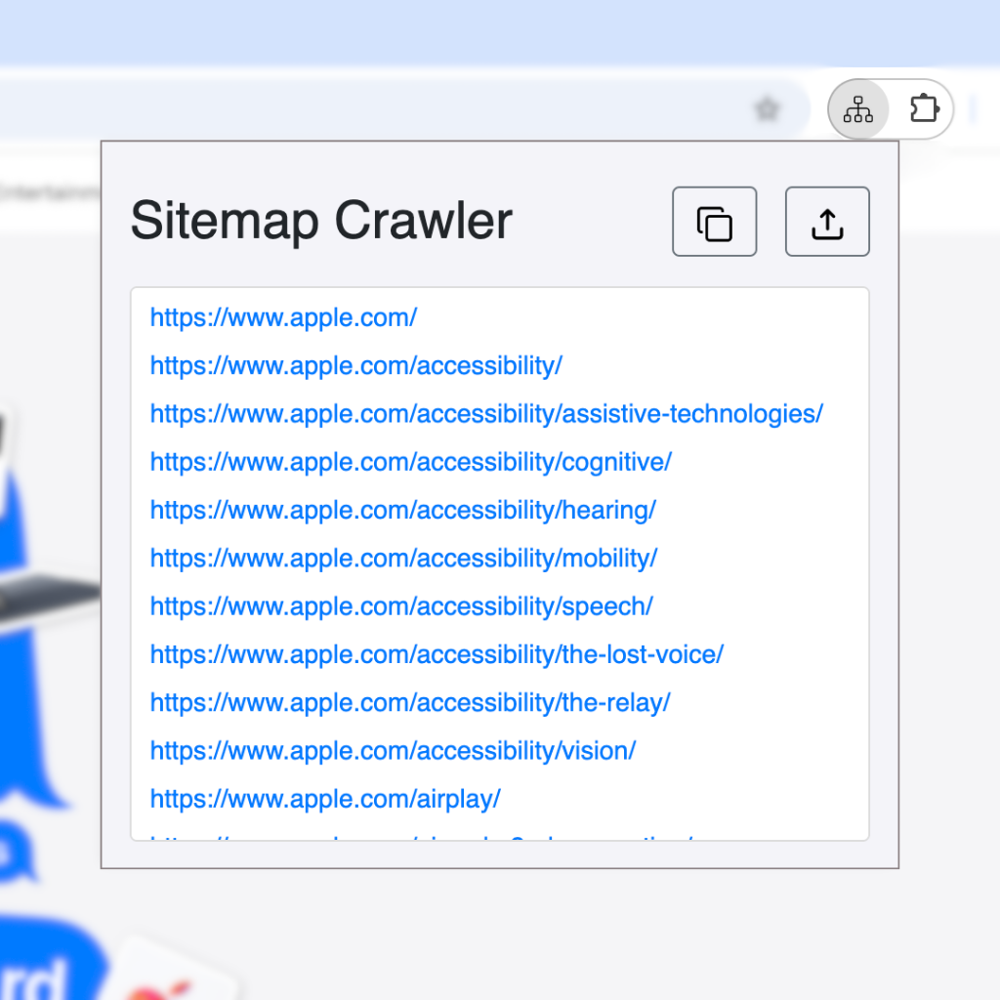

# Sitemap Crawler
Sitemap Crawler is a Chrome extension that extracts and displays all URLs from the sitemap of the website you're currently visiting. Currently, the extension recursively unpacks URLs from a website's sitemap.xml file.

Users are able to copy the results, as well as export them as a *.txt* file

  

&nbsp;

Viewing the webpages associated with a website can reveal hidden or inaccessible pages that aren't easily found through regular browsing. By analyzing the sitemap, you can uncover archived content or obscure resources that provide deeper insights into the site's structure or undisclosed information. This can be crucial for investigations, security assessments, or understanding the full extent of a website's online presence.

## Installation
1. Download and extract the `Sitemap Crawler.zip` file from the Releases page. 
2. Open Google Chrome and navigate to `chrome://extensions/`.
3. In the top right corner, enable **Developer mode**.
4. Click on the **Load unpacked** button.
5. Find and select the extracted `Sitemap Crawler`.

Your extension is now installed and ready to use.

## Notes
I plan to create a Chrome Extension featuring a wide variety of website/domain analysis tools.
